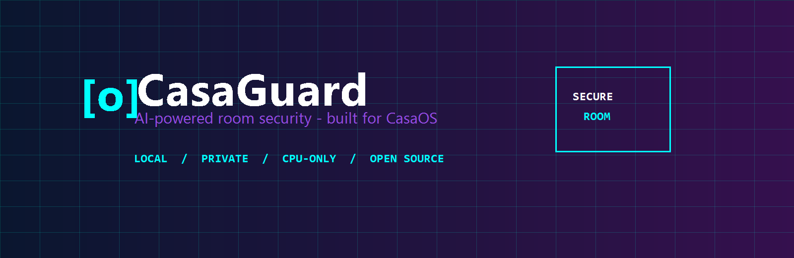
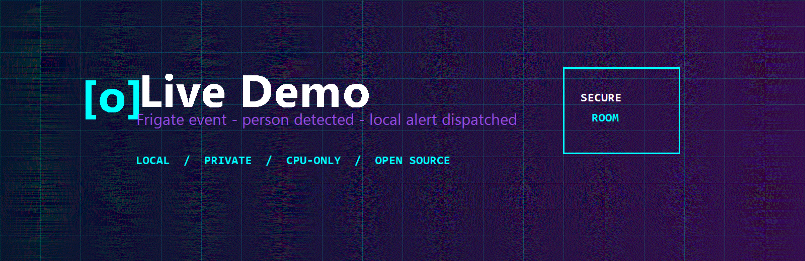

<p align="center">
  
</p>

<p align="center">
  <a href="LICENSE"></a>
  
  
  
</p>

<p align="center"><strong>Private, local-first security for USB, ONVIF, and RTSP cameras.</strong><br>Automatic discovery • native-quality live feeds • no cloud account • Docker Compose</p>

```
   _____                 ____                     _
  / ____|               / ___|_   _  __ _ _ __ __| |
 | |     __ _ ___  __ _| |  _| | | |/ _` | '__/ _` |
 | |___ / _` / __|/ _` | |_| | |_| | (_| | | | (_| |
  \_____\__,_|___/\__,_|\____|\__,_|\__,_|_|  \__,_|
```

> [!WARNING]
> Cameras can capture sensitive information. Tell people when they are being recorded, secure the host, and follow the laws that apply where you operate it. Do not expose Frigate or CodeProject.AI directly to the public internet.

## Why CasaGuard?

| | Capability | What it does locally |
|---:|---|---|
| 🔒 | **Person detection** | Alerts on people and retains a 30-day event record. |
| 👤 | **Face recognition** | Optional known-face matching in CodeProject.AI. |
| 🎵 | **Audio alerts** | Optional sound classification after a microphone is configured. |
| 📱 | **Mobile notifications** | Frigate browser notifications; use its API with Home Assistant/ntfy for phone delivery. |
| 🧠 | **Custom AI models** | Mount compatible CodeProject.AI models in `models/`. |

## One-click deploy

On your CasaOS host, clone this repository and run:

```bash
git clone https://github.com/YOUR-ACCOUNT/casaguard.git
cd casaguard
chmod +x scripts/*.sh && ./scripts/install.sh
```

Open `http://YOUR-CASAOS-IP:8971` to review discovered cameras, then open `http://YOUR-CASAOS-IP:5000` to finish Frigate’s first-run administrator setup. The first CodeProject.AI start can take several minutes while it initializes.

### Quick start — three commands

```bash
git clone https://github.com/YOUR-ACCOUNT/casaguard.git && cd casaguard
cp .env.example .env
./scripts/install.sh
```

Set `TZ` in `.env` (for example `America/Chicago`) before the final command. The first-login password is deliberately set in Frigate’s browser UI rather than stored in Compose or Git.

## Architecture

```mermaid
flowchart LR
  cam["📷 USB / ONVIF / RTSP cameras"] -->|"Native resolution and FPS"]| manager["Camera manager\ndiscovery + validation"]
  manager --> frigate["🔒 Frigate NVR\nH.264 live view + recordings"]
  frigate -->|"events, snapshots & API"| ui["🖥️ Frigate UI / browser notifications"]
  frigate -. "snapshot or recording export" .-> cpai["🧠 CodeProject.AI\nface + custom object + audio modules"]
  cpai -->|"match / classification result"| alerts["📱 Your alert integration\nHome Assistant, ntfy, or webhook bridge"]
```

Frigate and CodeProject.AI are intentionally separate services: Frigate owns real-time NVR detection, while CodeProject.AI is available for enrichment workflows. See [AI features](docs/AI_FEATURES.md) for exact API calls and the supported module installation path.

## Screenshots

| Frigate UI | CodeProject.AI Dashboard | Mobile Alert |
|---|---|---|
|  |  |  |
| Live stream, review, and recordings | Module health and AI endpoints | Connect via browser push or your preferred alert bridge |

## Hardware requirements

| Component | Minimum | CasaGuard target |
|---|---:|---:|
| Host OS | 64-bit Linux + Docker Compose v2 | CasaOS on Linux |
| CPU | 2 modern cores | **AMD Ryzen laptop — ✅ Tested & Verified profile** |
| Memory | 4 GB | **8 GB — ✅ Tested & Verified profile** |
| Camera | V4L2 USB or ONVIF/RTSP network camera | Multiple cameras supported |
| Storage | 20 GB free | 100 GB+ recommended for seven days of continuous video |
| GPU | Not required | **No GPU acceleration used** |

The `1.5 GB` Frigate and `1 GB` CodeProject.AI ceilings preserve memory for CasaOS. Face/audio workloads are bursty; avoid running both continuously on an 8 GB system.

## CasaGuard vs. cloud cameras

| Capability | CasaGuard | Ring | Nest | Arlo |
|---|:---:|:---:|:---:|:---:|
| Video stays local | ✅ | ❌ | ❌ | ❌ |
| Required subscription | **No** | Often | Often | Often |
| Open source | ✅ | ❌ | ❌ | ❌ |
| Use your USB webcam | ✅ | ❌ | ❌ | ❌ |
| Works without an internet account | ✅ | ❌ | ❌ | ❌ |

## Ports and data

| Service | Port | Use |
|---|---:|---|
| Frigate | `5000` | NVR UI and API |
| Camera manager | `8971` | Discovery, native mode details, and RTSP setup |
| go2rtc | `8554`, `8555` | Local RTSP / WebRTC live view |
| CodeProject.AI | `32168` | Dashboard and REST API |

Persistent Docker volumes are `casaguard_frigate_config`, `casaguard_frigate_media`, `casaguard_codeproject_data`, and `casaguard_codeproject_modules`. Back them up before upgrading.

## Documentation

- [Setup on CasaOS and Docker](docs/SETUP.md)
- [Troubleshooting](docs/TROUBLESHOOTING.md)
- [AI features, faces, custom objects, and sound](docs/AI_FEATURES.md)

## Contributing and license

Issues and improvements are welcome. Keep pull requests focused, never commit recordings or `.env`, and test camera changes with `scripts/camera-test.sh`. CasaGuard is released under the [MIT License](LICENSE).
